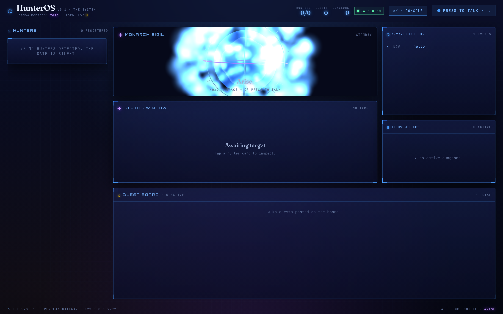
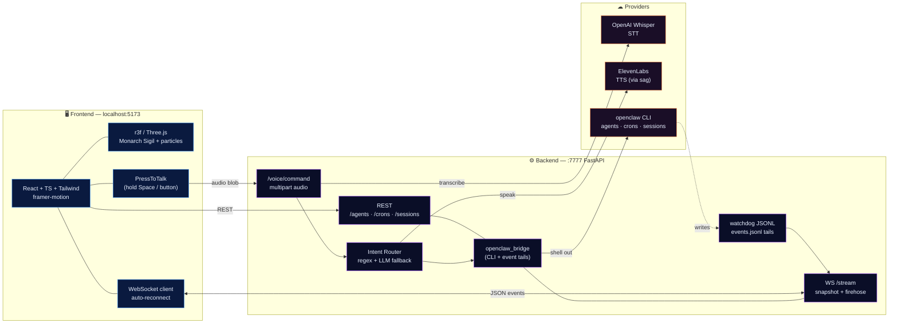

# 🎆 HunterOS

> **_"Arise."_** — A voice-controlled, Solo-Leveling-inspired command bridge for [OpenClaw](https://docs.openclaw.ai) multi-agent systems.

<p align="center">
  
</p>

<p align="center">
  <a href="#quick-start"></a>
  <a href="#tech-stack"></a>
  <a href="#voice-pipeline"></a>
  <a href="LICENSE"></a>
</p>

---

## What is this?

**HunterOS** turns your [OpenClaw](https://github.com/openclaw/openclaw) agent fleet into a **Solo-Leveling System interface**:

- 🥋 Each OpenClaw agent is a **Hunter** with an E → S rank, level, HP/MP, class, and signature skill — derived from live session activity, model power, and elevated privileges.
- 📜 Every cron is a **Quest** on the board with schedule, payload, last-run telemetry, and one-click dispatch.
- 🔮 The **Monarch Sigil** at the center is a real-time 3D voice orb (r3f + GLSL fresnel shader + 320-particle cloud) that reacts to your voice, listens when you hold **Space**, and speaks back through ElevenLabs.
- 🌀 Destructive intents (`kill`, `cron.rm`) require confirmation through a holographic **Approval Modal** — the System stops your Shadow Soldiers from doing anything stupid.
- ⚔️ When a Hunter ranks up, the log flashes monarch-violet. When you summon a new agent, an **"Arise"** impulse radiates from the sigil across every Hunter card.

> Voice-first orchestration dashboard. Built in a single morning hackathon sprint.

---

## 📽️ Demo

<!-- DEMO_VIDEO_PLACEHOLDER -->
_Remotion demo reel rendering — will be linked here shortly._

**Sample TTS sample** (ElevenLabs "Harry — Fierce Warrior" as the System voice):

▶ [`snaps/arise.mp3`](snaps/arise.mp3) — _"Arise. HunterOS online. Nine hunters registered."_

---

## 🏛 Architecture



### Rank formula

```
rank = clamp(
  base(model_power)        // 1-5 based on model tier
  + ceil(sessions_7d / 10) // +1 every 10 recent sessions
  + (elevated ? 1 : 0),    // +1 if privileged
  [E, D, C, B, A, S]
)
```

Opus 4.7 + active daily use ⇒ **S-rank**. Sonnet + quiet ⇒ **C-rank**.

---

## ✨ Features

|   | Feature | What it does |
|:--|:--|:--|
| 🎙️ | **Press-to-talk voice** | Hold Space (or the header button) → RMS level meter → Whisper transcribes → intent routes → result TTS'd back via ElevenLabs |
| 🗃️ | **Live hunter cards** | Rank badge, class, level, HP/MP bars, skill tree, elevated glyph; updates over WS with no refresh |
| 📜 | **Quest Board** | All crons with schedule, enabled flag, next-run, last-result, one-click dispatch |
| 🎆 | **Monarch Sigil (3D)** | r3f procedural orb with fresnel shader, noise-driven vertex displacement, additive particle cloud, "Arise" impulse column |
| ⌘K | **Command Palette** | Fuzzy keyboard-first console for everything the voice understands |
| 🛡️ | **Approval Modal** | Destructive intents pause for confirmation — no accidental `kill`s |
| 📡 | **System Log** | Typewriter-rendered live event stream (tail of all workspace `events.jsonl` files) |
| 👑 | **Rank-up FX** | Detects rank promotions across ticks and pulses the card + log in monarch violet |
| 📈 | **Status Window** | Tap a Hunter → full dossier (model, workspace, routing, skills, last-touched) |

---

## 🗣 Voice pipeline

```
  🎙 mic
   │  WebM/opus blob
   ▼
POST /voice/command
   │  form-data: audio, autoSpeak=1
   ▼
openai/whisper-1 (STT)
   │  transcript
   ▼
intent router  ← regex grammar, LLM fallback
   │  { intent, slots, destructive? }
   ▼
openclaw_bridge  (spawn | kill | status | crons | dispatch | snapshot | theme …)
   │  result JSON
   ▼
ElevenLabs via `sag` CLI (TTS — voice: Harry "Fierce Warrior")
   │  mp3 path
   ▼
frontend <audio>  → VoiceOrb enters "speaking" state
```

### Voice grammar (excerpt)

```
status report on <agent>        → status
who's online                    → presence
show quests                     → crons
run quest <id|name>             → cron.run
arise, spawn a <agent>          → spawn         (triggers Arise FX)
dispatch <agent> to <task>      → dispatch
kill <session>                  → kill          🛑 needs confirmation
remove quest <id>               → cron.rm       🛑 needs confirmation
snapshot <node>                 → snapshot
theme monarch / shadow          → theme
```

---

## 🧰 Tech stack

**Backend** (`backend/`)
- Python 3.14 · FastAPI · Uvicorn
- watchdog (JSONL tails) · httpx · pydantic
- `sag` CLI (ElevenLabs) · OpenAI Whisper API
- Wraps the `openclaw` CLI with a 30s TTL cache

**Frontend** (`frontend/`)
- Vite + React 19 + TypeScript
- Tailwind 3 + custom `theme.css` design system
- Framer Motion · zustand · clsx
- `@react-three/fiber` + drei + Three.js + `simplex-noise`
- Custom GLSL fresnel + noise displacement shader

**Design**
- Solo Leveling dark-void aesthetic: `#0a0e27` void · `#4a9eff` hologram blue · `#9b4aff` monarch violet · quest gold · danger crimson
- Anthropic-warm accent: Fraunces serif for display, mono for telemetry
- 12 keyframe animations (flicker, scanlines, caret, rank-pulse, arise-radial, …)

See [`docs/DESIGN_SYSTEM.md`](docs/DESIGN_SYSTEM.md) (21 kB) and [`docs/3D_HERO.md`](docs/3D_HERO.md) (10 kB) for the full spec.

---

## 🚀 Quick Start

### Prerequisites

- **OpenClaw** installed & configured — the backend shells out to the `openclaw` CLI for agents/crons/sessions
- **Python 3.11+**, **Node 18+**, **npm**
- **OpenAI API key** for Whisper (`OPENAI_API_KEY`)
- **ElevenLabs API key** for TTS (`ELEVENLABS_API_KEY`) + the [`sag`](https://github.com/openclaw/sag) CLI
- (Optional) a modern browser with WebAudio + getUserMedia for voice

### Backend

```bash
cd backend
python3 -m venv .venv && source .venv/bin/activate
pip install -r requirements.txt

export OPENAI_API_KEY=sk-...
export ELEVENLABS_API_KEY=...
export HUNTEROS_TTS_VOICE="Harry"   # optional; any ElevenLabs voice name

python main.py
# → http://127.0.0.1:7777
```

### Frontend

```bash
cd frontend
npm install
npm run dev
# → http://localhost:5173
```

Open [http://localhost:5173](http://localhost:5173), hold **Space**, and say:

> *"Status report on main."*

---

## 🧭 Project layout

```
hunteros/
├─ backend/
│  ├─ main.py              # FastAPI app, WS /stream, REST, voice endpoint
│  ├─ openclaw_bridge.py   # shells out to `openclaw`, caches agents, tails JSONL
│  ├─ intents.py           # regex-first intent router (+ LLM fallback hook)
│  ├─ voice.py             # Whisper STT + `sag` TTS glue
│  └─ requirements.txt
├─ frontend/
│  ├─ src/
│  │  ├─ App.tsx                 # layout + REST + WS + voice + approval gate
│  │  ├─ store.ts                # zustand store; rank-up detection; arise impulse
│  │  ├─ theme.css               # design tokens + keyframes + utilities
│  │  ├─ lib/{api,ws,rank,format}.ts
│  │  └─ components/
│  │     ├─ HunterCard.tsx + HunterGrid
│  │     ├─ RankBadge.tsx · StatBar.tsx · SkillTree.tsx · StatusWindow.tsx
│  │     ├─ QuestBoard.tsx
│  │     ├─ SystemLog.tsx · SystemNotification.tsx
│  │     ├─ VoiceOrb.tsx   (r3f + fresnel shader + particle cloud + AriseColumn)
│  │     ├─ PressToTalk.tsx  (hold-Space + RMS meter)
│  │     ├─ CommandPalette.tsx  (⌘K)
│  │     └─ ApprovalModal.tsx
│  └─ tailwind.config.js
├─ docs/
│  ├─ DESIGN_SYSTEM.md    # tokens, type scale, motion, a11y, 12-component inventory
│  ├─ 3D_HERO.md          # Monarch Sigil procedural r3f concept + GLSL + fallback
│  └─ HANDOFF.md
├─ snaps/                 # screenshots + sample TTS
└─ SPEC.md                # original vision doc
```

---

## 🧪 Roadmap

- [x] Web-first MVP — voice + dashboard + 3D sigil
- [x] Destructive intent approval gate
- [x] Rank-up detection & "Arise" impulse FX
- [ ] Code-split r3f/drei (main bundle still >500 kB)
- [ ] Offline STT fallback (whisper.cpp) for <300 ms turnaround
- [ ] Electron wrapper + system tray + global hotkey
- [ ] Theme variants: Shadow Monarch / Frost Queen / Blaze Sage
- [ ] Per-Hunter XP curves from actual token usage
- [ ] Sound design pass — ElevenLabs Music for quest-complete stings
- [ ] Dungeon drill-down: live message view for any session from the Dungeon list
- [ ] Gate-scan mini-game: weekly boss = biggest-cost agent 😈

---

## 🪨 Known issues

- Main JS bundle is **~1.25 MB** — r3f/drei dominate; code-split candidate
- First `/agents` request takes ~15 s (backs the `openclaw agents list` CLI) — cached 30 s afterwards
- If you run OpenClaw with the plugin allowlist excluding `events`, JSONL tailing still works (falls back to the filesystem), but some live telemetry won't populate
- The dashboard assumes a single local gateway at `127.0.0.1` — multi-gateway coming later

---

## 🙏 Credits

- **[OpenClaw](https://docs.openclaw.ai)** — the multi-agent runtime this sits on top of
- **[Solo Leveling](https://en.wikipedia.org/wiki/Solo_Leveling)** by Chugong — UI spiritual ancestor (vibe only, no copyrighted assets)
- **[Anthropic Claude](https://www.anthropic.com)** — Opus 4.7 drove the full design system & 3D hero pass
- **ElevenLabs** — the voice of the System (Harry "Fierce Warrior")
- **OpenAI Whisper** — STT

---

## 📜 License

MIT — see [`LICENSE`](LICENSE).

---

<p align="center"><sub>
  Built with 🔨 in one morning — <code>openclaw</code> + <code>react-three-fiber</code> + stubborn optimism.
</sub></p>
